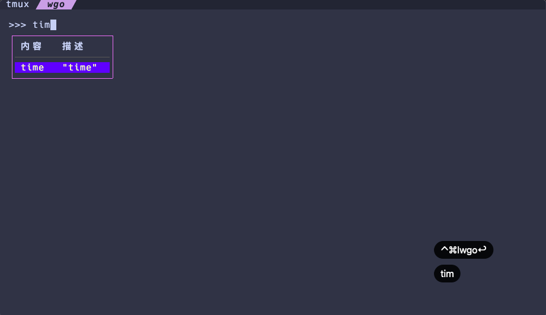

# wgo · 类 IPython 的 Golang 交互运行工具

<div align="center">


</div>

wgo 提供一个面向初学者与工程实践的 Go 交互式环境（REPL-like），支持即时编写、补全、运行与查看结果。
核心特性包括基于 LSP 的代码补全、表达式自动打印、变量持久化复用、错误信息可读化等。

## 功能预览



## 安装

推荐使用 Homebrew（macOS/Linux）：

```bash
brew install wxnacy/tap/wgo
```

升级：

```bash
brew upgrade wxnacy/tap/wgo
```

其他安装方式：

- go install

```bash
$ go install github.com/wxnacy/wgo/cmd/wgo@latest
$ go install golang.org/x/tools/cmd/goimports@latest
$ go install golang.org/x/tools/gopls@latest
```

- Makefile（开发者）

```bash
make install
# 验证
wgo -h
```

说明：
- 代码补全依赖 gopls；可通过 `brew install gopls` 或 `go install golang.org/x/tools/gopls@latest` 安装。
- 已在 macOS、Linux 测试；Windows 用户请前往 [Releases](https://github.com/wxnacy/wgo/releases) 下载对应 zip 包。

## 使用

```bash
wgo
>>> fmt.Println("Hello, wgo")
Hello, wgo
```

### 变量持久化与复用

- 每次执行后，`main` 中出现且已赋值的变量会被序列化保存。
- 下次输入时，这些变量会被反序列化还原，可直接继续使用（包括函数字面量）。


### 直接输出变量

可以像 Python 命令行那样，输入变量名，直接打印

```bash
>>> t := time.Now()
>>> t
2019-03-19 17:54:36.626646507 +0800 CST m=+0.000424636

```

或者直接输入对象进行打印

```bash
>>> time.Now()
2019-03-19 17:54:36.626646507 +0800 CST m=+0.000424636
```

### 退出

`<c-d>` 或者输入 `/exit`

### 代码补全

如果想要代码补全，需要安装 [gopls](https://github.com/golang/tools/tree/master/gopls)

```bash
$ go install golang.org/x/tools/gopls@latest
```


## 更新日志

[HISTORY](HISTORY.md)
